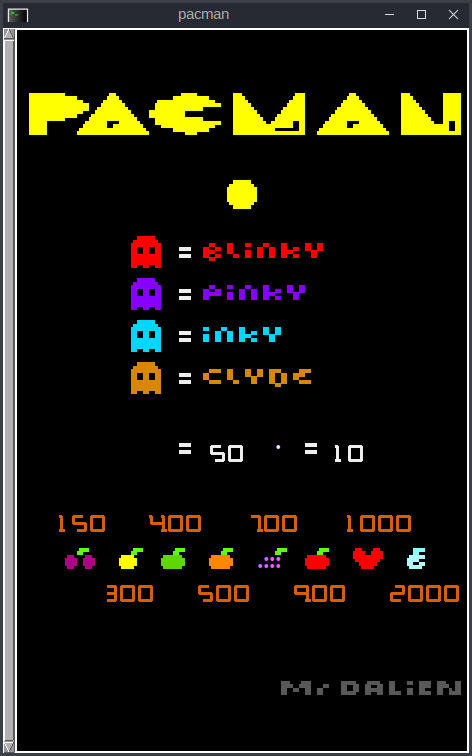
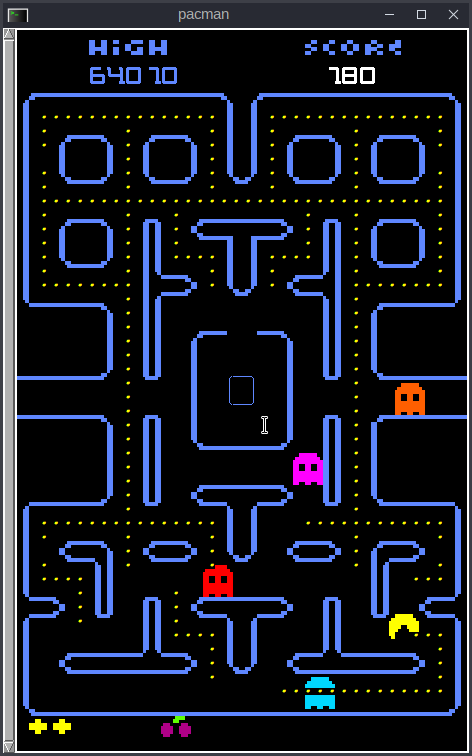
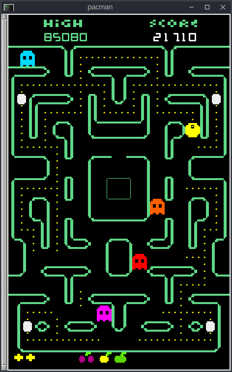

# Pacman
Pacman  - clasical game made with Gadget library for C-Linux Debian and derivatives.

Para jugar, debe tener instalada la librería Gadget y compilar. Luego, el juego es un ejecutable independiente de la librería, si se compila con la opción "-static".

# Requisitos.

Debe tener instalada la librería GADGET para GCC de Linux (Debian y sus derivados Ubuntu, Mint, etc).

Debe tener instalados el terminal RXVT, y los programas FFPLAY y XSET (aunque estos últimos creo que ya vienen de facto).

Con FFPLAY ejecuto los efectos de sonido y la música de fondo, con repetición.

Con XSET redefino el delay y el rate del teclado, para una mejor experiencia de juego.

# Compilación.

     ./ccpre.sh <directorio>/pacman -static

# Ejecución.

     ./<directorio>/pacman.sh [-mr|-mrs] [-l <1-5>] [-c]

donde:

* -mr|-mrs establece los efectos de sonido de Pacman (Namco) y de Mrs. Pacman (Midway);
* -l <1-5> inicia el juego en una de las cinco pantallas del juego,
* -c permite continuar el juego pese a perder el último player, reseteando el puntaje.
* -a muestra todos los intermission del juego.

# Screenshots.

